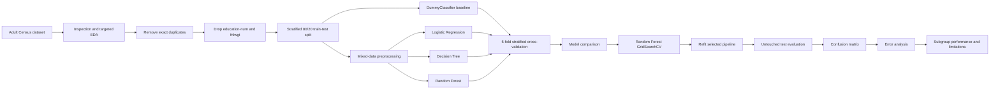
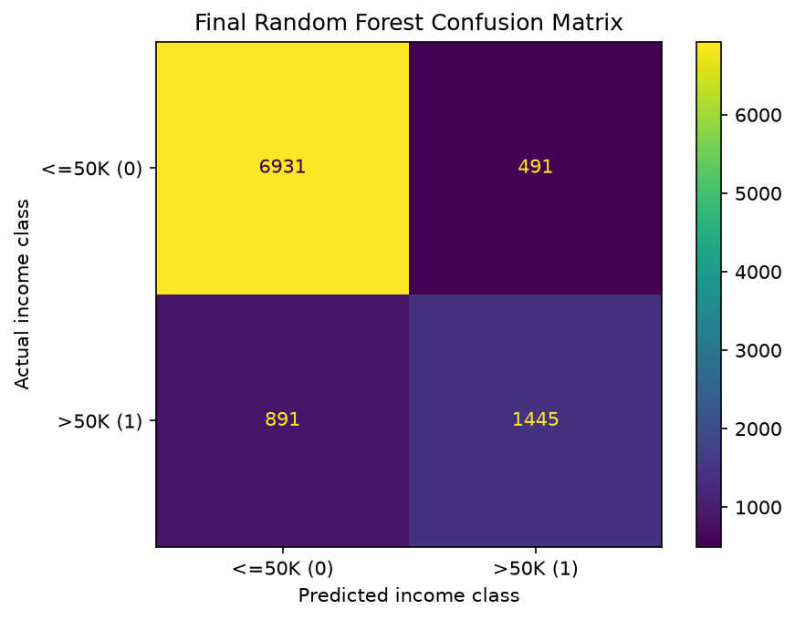

# Adult Census Income Classification

An end-to-end classical machine-learning project using scikit-learn and the Adult Census Income dataset.

The objective is to predict whether recorded annual income exceeds `$50K` using mixed numerical and categorical demographic and employment-related features.

The project focuses on leakage-safe preprocessing, comparison of multiple classical model families, bounded Random Forest tuning, held-out evaluation, targeted error analysis, and descriptive subgroup performance analysis.

## Project overview

The workflow is organised into five stages:

- **Data understanding and preparation:** inspect the dataset, review missingness and categorical structure, remove exact duplicate rows, make justified feature exclusions, and create a stratified development/test split.
- **Mixed-data preprocessing:** construct separate numerical and categorical preprocessing branches inside scikit-learn `ColumnTransformer` and `Pipeline` objects.
- **Model comparison:** compare a majority-class baseline, Logistic Regression, Decision Tree, and Random Forest using the same five-fold stratified cross-validation framework.
- **Bounded tuning and final evaluation:** tune the selected Random Forest over a predefined search space, refit the selected pipeline on all development data, and evaluate it once on the untouched test set.
- **Interpretation:** analyse false-positive and false-negative patterns, examine descriptive subgroup performance for selected sensitive attributes, and discuss limitations and responsible use.

The project is intentionally bounded. It is designed to demonstrate a complete classical tabular ML workflow rather than maximise benchmark performance or build a deployable income-prediction system.

## Dataset

The project uses the **Adult Census Income** dataset, loaded through OpenML:

```python
from sklearn.datasets import fetch_openml

data = fetch_openml(name="adult", version=2, as_frame=True)
df = data.frame.copy()
```

The raw dataset contains:

- **48,842 observations**
- **14 predictor columns**
- **1 binary target column**
- a mixture of numerical and categorical features
- missing values in selected categorical features
- a moderately imbalanced target distribution

The target is encoded as:

```text
0 = income <= $50K
1 = income > $50K
```

This makes `>50K` the positive class used for precision, recall, and F1.

Approximately:

```text
76%  <=50K
24%   >50K
```

of observations belong to the two target classes respectively.

### Feature decisions

Two predictors were excluded after inspection:

- **`education-num`** — removed because it represents the same underlying education concept as the categorical `education` feature and would otherwise duplicate that information.
- **`fnlwgt`** — removed because it is Census survey-design weighting metadata rather than an individual characteristic aligned with the intended prediction framing.

Exact full-row duplicates were removed before these feature exclusions.

After removing **52 duplicate rows**, the modelling dataset contains:

- **48,790 observations**
- **12 predictors**
- **4 numerical features**
- **8 categorical features**

### Final predictor groups

Numerical:

```text
age
capital-gain
capital-loss
hours-per-week
```

Categorical:

```text
workclass
education
marital-status
occupation
relationship
race
sex
native-country
```

## Machine-learning task

- **Task:** supervised binary classification
- **Positive class:** income `>50K`
- **Development/test split:** stratified 80/20 split
- **Baseline:** `DummyClassifier(strategy="most_frequent")`
- **Compared models:** Logistic Regression, Decision Tree, Random Forest
- **Primary development metric:** balanced accuracy
- **Secondary metrics:** accuracy, precision, recall, F1
- **Cross-validation:** five-fold `StratifiedKFold`
- **Tuning method:** `GridSearchCV`
- **Final evaluation:** one untouched holdout test set

Balanced accuracy is used as the primary comparison metric because ordinary accuracy is strongly influenced by the majority `<=50K` class.

## Workflow



## Preprocessing

All data-dependent preprocessing is performed **inside scikit-learn pipelines** so that each transformation is fitted only on the training data available within each cross-validation fold.

### Logistic Regression preprocessing

Numerical features:

```text
StandardScaler
```

Categorical features:

```text
SimpleImputer(strategy="most_frequent")
→ OneHotEncoder(handle_unknown="ignore")
```

The numerical and categorical branches are combined using `ColumnTransformer`.

### Tree-based preprocessing

Decision Tree and Random Forest use the same categorical preprocessing:

```text
SimpleImputer(strategy="most_frequent")
→ OneHotEncoder(handle_unknown="ignore")
```

Numerical predictors are passed through without standardisation because tree-based models do not require feature scaling.

## Evaluation strategy

A stratified 80/20 train-test split is created before model development.

The **development split** is used for:

- baseline evaluation;
- model comparison;
- cross-validation;
- hyperparameter selection.

The **test split** remains untouched until all model and hyperparameter decisions are complete.

Five-fold `StratifiedKFold` cross-validation with shuffling and a fixed random state is used throughout development so each model is compared under the same resampling procedure.

Nested cross-validation is not used because the final performance estimate comes from the separate holdout test set rather than from the hyperparameter-search CV score itself.

## Initial model comparison

Mean development cross-validation performance:

| Model | Balanced accuracy | Accuracy | Precision | Recall | F1 |
|---|---:|---:|---:|---:|---:|
| Dummy Classifier | 0.500 | 0.761 | 0.000 | 0.000 | 0.000 |
| Logistic Regression | 0.762 | 0.851 | 0.732 | 0.593 | 0.655 |
| Decision Tree | 0.748 | 0.820 | 0.627 | 0.610 | 0.619 |
| Random Forest | 0.766 | 0.845 | 0.702 | 0.614 | 0.655 |

The majority-class baseline achieves approximately `0.761` accuracy while never predicting the positive class, demonstrating why ordinary accuracy alone is not appropriate for model selection.

Logistic Regression and Random Forest produced the strongest validation performance.

Logistic Regression showed little train-validation divergence, while the default Random Forest showed a large generalisation gap:

```text
Random Forest training balanced accuracy   ≈ 0.963
Random Forest validation balanced accuracy ≈ 0.766
```

Random Forest was selected for one bounded tuning experiment because:

- it achieved the highest mean value on the predeclared primary metric;
- its advantage over Logistic Regression was small rather than decisive;
- it showed substantial overfitting that could plausibly be addressed through tree-complexity regularisation;
- Logistic Regression regularisation had already been explored in the preceding numerical-only project.

The project therefore does **not** claim that Random Forest is universally superior to a fully optimised Logistic Regression model.

## Random Forest hyperparameter tuning

Three hyperparameters were selected because they directly affect tree complexity or ensemble diversity:

- `max_depth`
- `min_samples_leaf`
- `max_features`

The predefined search space was:

```python
param_grid = {
    "classifier__max_depth": [None, 10, 15, 20],
    "classifier__min_samples_leaf": [1, 3, 5, 7],
    "classifier__max_features": ["sqrt", 0.25, 0.5, 0.75],
}
```

This gives:

```text
4 × 4 × 4 = 64 parameter combinations
```

evaluated with the same five-fold stratified CV procedure.

### Best configuration

```text
max_depth = None
min_samples_leaf = 3
max_features = 0.5
```

The strongest configurations generally retained unrestricted tree depth while increasing `min_samples_leaf`, suggesting that preventing highly specific terminal leaves was more useful than imposing a strict depth ceiling.

### Default vs tuned Random Forest

| Configuration | Train balanced accuracy | CV balanced accuracy | Train-CV gap |
|---|---:|---:|---:|
| Default Random Forest | 0.963 | 0.766 | 0.197 |
| Tuned Random Forest | 0.862 | 0.778 | 0.084 |

Tuning:

- increased mean CV balanced accuracy from approximately `0.766` to `0.778`;
- reduced training balanced accuracy from approximately `0.963` to `0.862`;
- reduced the train-validation gap from approximately `0.197` to `0.084`.

This supports the original tuning hypothesis: modest regularisation reduced excessive training fit while preserving and slightly improving validation performance.

## Final held-out evaluation

`GridSearchCV` uses `refit=True`, so the selected pipeline is refitted on the complete development split before final evaluation.

The tuned Random Forest is then evaluated **once** on the untouched test set.

| Metric | Test score |
|---|---:|
| Accuracy | 0.858 |
| Balanced accuracy | 0.776 |
| Precision | 0.746 |
| Recall | 0.619 |
| F1 | 0.676 |

The final balanced accuracy of `0.776` closely matches the tuned CV estimate of approximately `0.778`, with no substantial deterioration on the unseen holdout set.

### Confusion matrix



The test-set confusion matrix contains:

- **6,931 true negatives**
- **491 false positives**
- **891 false negatives**
- **1,445 true positives**

Negative-class recall / specificity is approximately:

```text
0.934
```

while positive-class recall is:

```text
0.619
```

The classifier therefore recognises the `<=50K` class substantially more reliably than the `>50K` class.

Precision of `0.746` indicates that approximately three quarters of positive predictions are correct, while recall of `0.619` shows that a substantial proportion of actual positive cases remain missed.

## Error analysis

The final evaluation establishes **how often** the model makes errors. The error analysis examines whether false positives and false negatives show recurring descriptive patterns in the original test-set features.

The analysis compares:

```text
True Positives vs False Negatives
→ among actual >50K observations, what differs between cases recognised and missed?

True Negatives vs False Positives
→ among actual <=50K observations, what differs between cases correctly rejected and incorrectly predicted positive?
```

### Numerical patterns

Among actual `>50K` observations:

- false negatives had a median age of `42` compared with `44` for true positives;
- false negatives worked a median of `40` hours per week compared with `45` for true positives.

Among actual `<=50K` observations:

- false positives had a median age of `43` compared with `33` for true negatives;
- median working hours were `40` in both groups.

Capital activity showed a stronger positive-class distinction:

- non-zero `capital-gain` occurred in `32.5%` of true positives but only `3.6%` of false negatives;
- non-zero `capital-loss` occurred in `12.5%` of true positives but only `2.1%` of false negatives.

Capital activity was much more similar between true negatives and false positives.

### Categorical patterns

Education showed a clear broad pattern:

- actual `>50K` cases with lower educational attainment were more frequently missed;
- actual `<=50K` cases with advanced education were more frequently predicted as positive.

For example:

```text
FN rate among actual >50K
HS-grad       63.1%
Some-college  51.8%
Bachelors     22.7%
Masters       17.3%
```

Occupation showed a similar, though less pronounced, pattern:

- false-negative rates were generally higher in several manual and service occupations;
- false-positive rates were higher in managerial and professional occupations.

These results are descriptive associations. They do not establish that individual predictors caused specific model decisions.

## Descriptive subgroup performance

Overall performance can conceal differences between demographic groups.

A limited descriptive subgroup analysis was therefore performed for the recorded sensitive attributes `sex` and `race`.

The analysis reports:

- subgroup sample size;
- positive-class prevalence;
- positive-class recall;
- false-positive rate;
- balanced accuracy.

These metrics are used to describe observed differences in classifier behaviour, not to declare the model fair or unfair.

### Sex

| Sex | Test count | Positive prevalence | Recall | False-positive rate | Balanced accuracy |
|---|---:|---:|---:|---:|---:|
| Female | 3,232 | 0.104 | 0.542 | 0.026 | 0.758 |
| Male | 6,526 | 0.306 | 0.632 | 0.092 | 0.770 |

The model showed different class-specific error behaviour across the two recorded sex groups:

- positive-class recall was lower for Female observations;
- false-positive rate was lower for Female observations;
- balanced accuracy was relatively similar across the two groups.

The underlying positive-class prevalence also differed substantially, providing important context for these comparisons.

### Race

| Race | Test count | Positive prevalence | Recall | False-positive rate | Balanced accuracy |
|---|---:|---:|---:|---:|---:|
| Amer-Indian-Eskimo | 93 | 0.097 | 0.444 | 0.048 | 0.698 |
| Asian-Pac-Islander | 291 | 0.306 | 0.640 | 0.084 | 0.778 |
| Black | 923 | 0.117 | 0.556 | 0.026 | 0.765 |
| Other | 75 | 0.133 | 0.500 | 0.015 | 0.742 |
| White | 8,376 | 0.253 | 0.622 | 0.072 | 0.775 |

Balanced accuracy was relatively similar across the three larger groups, while estimates for the smaller groups were based on far fewer observations and positive cases and are therefore less stable.

The demographic categories used by this historical dataset are coarse and should not be treated as a complete or contemporary representation of identity.

This analysis is descriptive and does not constitute a formal fairness audit.

## Main findings

The project produced five main findings:

1. The majority-class baseline achieved apparently reasonable raw accuracy while completely failing to identify the positive class, reinforcing the need for balanced accuracy and class-specific metrics.
2. Logistic Regression and Random Forest provided the strongest default validation performance, while the unrestricted Decision Tree showed clear overfitting.
3. Random Forest tuning reduced the train-validation balanced-accuracy gap from approximately `0.197` to `0.084` while increasing CV balanced accuracy from `0.766` to `0.778`.
4. The tuned Random Forest achieved `0.776` balanced accuracy on the untouched test set, closely matching its cross-validation estimate.
5. Error and subgroup analyses showed that aggregate model performance does not fully describe where the classifier succeeds and fails.

## Repository structure

```text
adult-income-classification/
├── README.md
├── PROJECT_PLAN.md
├── adult_income_workflow.ipynb
├── confusion_matrix.png
├── requirements.txt
└── .gitignore
```

- `README.md` — project overview, methodology, results, interpretation, and limitations.
- `PROJECT_PLAN.md` — original implementation plan, learning objectives, and explicit project scope.
- `adult_income_workflow.ipynb` — complete data inspection, preprocessing, modelling, tuning, evaluation, error analysis, and subgroup analysis.
- `confusion_matrix.png` — final tuned Random Forest confusion matrix on the held-out test set.
- `requirements.txt` — Python dependencies.
- `.gitignore` — excluded local and generated files.

## Installation

Clone the repository:

```bash
git clone <repository-url>
cd adult-income-classification
```

Create and activate a virtual environment.

### macOS or Linux

```bash
python3 -m venv .venv
source .venv/bin/activate
```

### Windows PowerShell

```powershell
python -m venv .venv
.venv\Scripts\Activate.ps1
```

Install the dependencies:

```bash
python -m pip install --upgrade pip
pip install -r requirements.txt
```

## Usage

Open the notebook:

```bash
jupyter notebook adult_income_workflow.ipynb
```

Run the notebook from top to bottom to reproduce:

- dataset loading and inspection;
- modelling-data preparation;
- mixed-data preprocessing;
- baseline and model comparison;
- Random Forest hyperparameter tuning;
- held-out evaluation;
- confusion matrix;
- numerical and categorical error analysis;
- descriptive subgroup performance analysis.

## Limitations

The results should be interpreted within the deliberately bounded scope of the project.

### Dataset and target

- The Adult dataset is historical and may not reflect current populations, labour markets, or socioeconomic relationships.
- The data are observational, so predictive associations should not be interpreted causally.
- Income is represented using a coarse binary `<=50K` / `>50K` target.
- Historical social and socioeconomic inequalities represented in the source data may be learned by the model.
- Some categorical and demographic groups contain relatively few observations.

### Features and preprocessing

- Missing categorical values are handled with simple most-frequent imputation.
- Rare-category grouping and missingness indicators were not explored.
- Categorical predictors are one-hot encoded rather than represented using alternative encoding approaches.
- No additional feature engineering, interaction construction, or automated feature-selection procedure was performed.

### Model development

- The project compares only Logistic Regression, Decision Tree, and Random Forest models alongside a dummy baseline.
- Only Random Forest received hyperparameter tuning, so the project does not establish that it is superior to fully optimised alternatives.
- The search evaluated three selected hyperparameters across 64 predefined combinations rather than the entire Random Forest hyperparameter space.
- Gradient-boosting methods, class weighting, resampling, threshold optimisation, and calibration were intentionally excluded.

### Evaluation and fairness

- Five-fold stratification preserves the target-class distribution but does not guarantee equal representation of other attributes within every fold.
- Final performance is estimated using one held-out split rather than external or temporal validation.
- Balanced accuracy gives equal importance to recall for both target classes but does not encode real-world costs of false-positive and false-negative errors.
- No confidence intervals were calculated for final or subgroup metrics.
- The subgroup analysis is limited to descriptive comparisons for `sex` and `race` and does not represent a complete fairness assessment.
- Other potentially relevant dimensions, intersectional groups, and formal fairness criteria were not evaluated.

### Interpretation and deployment

- No SHAP, permutation importance, partial dependence, or individual-prediction explainability analysis was performed.
- No external validation, deployment testing, monitoring, drift detection, or retraining strategy was developed.
- Predictive performance does not establish that the learned relationships are causal, socially appropriate, or suitable for consequential decisions.

The model is therefore **not intended for employment, lending, insurance, eligibility, public-policy, or other high-stakes decision-making**.

## Conclusion

This project demonstrates a complete and deliberately bounded classical machine-learning workflow for heterogeneous tabular data.

Mixed numerical and categorical features were processed using leakage-safe scikit-learn pipelines, multiple classical model families were compared under a consistent cross-validation framework, and the selected Random Forest was tuned using a bounded search.

The final model achieved a balanced accuracy of `0.776` on the untouched test set, closely matching its cross-validation estimate. Error and subgroup analyses additionally showed that aggregate predictive performance does not fully describe where the model succeeds or fails.

The project therefore demonstrates correct mixed-data preprocessing, baseline construction, model comparison, hyperparameter tuning, held-out evaluation, error analysis, and responsible interpretation while maintaining explicit limits around causal inference, fairness, and real-world use.

## References

- [UCI Adult dataset](https://archive.ics.uci.edu/dataset/2/adult)
- [OpenML](https://www.openml.org/)
- [scikit-learn documentation](https://scikit-learn.org/stable/)
- [scikit-learn MOOC](https://inria.github.io/scikit-learn-mooc/)